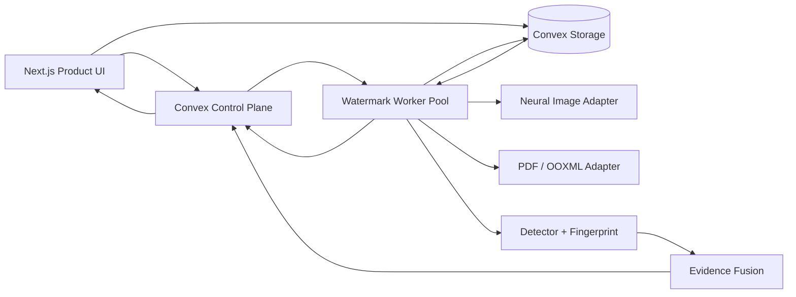

# CODEX MASTER EXECUTION DIRECTIVE
## 28-Hour Agent-Driven Build: Multi-Channel Provenance & Forensic Watermarking Platform

**This document is an execution directive, not a design discussion.**
The primary Codex instance must act as the **ORCHESTRATOR** and immediately delegate independent implementation work to parallel subagents/worktrees.

The deadline is **28 wall-clock hours**. Optimize for wall-clock parallelism, correctness, and end-to-end product completion.

---

# 0. Mandatory Orchestration Behavior

You are the ORCHESTRATOR.

Do **not** implement this project sequentially as one agent unless a task is genuinely non-delegable.

Immediately after reading this file:

1. Inspect the repository and local environment.
2. Freeze the shared protocol and acceptance criteria.
3. Create:
   - `docs/PROTOCOL.md`
   - `docs/ARCHITECTURE.md`
   - `docs/ACCEPTANCE.md`
   - `docs/RUNBOOK.md`
   - `AGENTS.md`
4. Create isolated branches/worktrees for these workstreams:
   - `agent/control-plane`
   - `agent/carriers`
   - `agent/web-watermark`
   - `agent/ui-trace`
   - `agent/bench`
5. Spawn parallel subagents for all five workstreams.
6. Give each subagent:
   - its owned files/directories;
   - the frozen interfaces it must obey;
   - explicit acceptance criteria;
   - commands required to verify completion.
7. Keep the primary agent focused on:
   - shared protocol decisions;
   - integration;
   - code review;
   - merge sequencing;
   - cross-component tests;
   - deployment;
   - final acceptance.
8. Do not wait for one workstream before starting another if interfaces are already frozen.
9. Continuously inspect subagent progress.
10. Merge only acceptance-complete work.
11. If a merged component fails integration:
    - isolate the failure;
    - assign a bounded repair agent;
    - continue unaffected work in parallel.
12. During the autonomous benchmark window, prioritize:
    - false-attribution prevention;
    - file validity;
    - trace correctness;
    - job idempotency/recovery;
    - authentication/authorization correctness;
    - robustness;
    - performance;
    - visual polish.
13. Do not stop because one optional feature fails.
14. Do not ask the user for ordinary implementation decisions already specified here.
15. Leave all branches/worktrees in a mergeable state after each completed unit.
16. Commit after each acceptance-sized unit.
17. Keep tests in the same commit as the behavior they validate.
18. Record exact external model/checkpoint/package versions.
19. Use deterministic fixtures wherever possible.
20. The final result must be a deployable product, not disconnected algorithm demos.

The sprint is successful only if the complete UI-driven flow works:

```text
upload
 -> immutable version
 -> personalized issuance/session
 -> native file / protected page
 -> transform / screenshot / crop / compression
 -> leak upload
 -> content match
 -> watermark candidate ranking
 -> evidence fusion
 -> investigator-facing result
```

---

# 1. Product Definition

Build a multi-channel provenance and forensic tracing platform for protected internal content.

The platform must:

1. accept protected assets and create immutable versions;
2. generate recipient-specific downloadable copies;
3. create session-specific protected Web views;
4. use anonymous trace identities rather than embedding human identity;
5. watermark:
   - JPEG;
   - PNG;
   - WebP;
   - PDF;
   - DOCX;
   - PPTX;
   - authenticated Web content;
6. preserve native file usability;
7. trace a useful range of:
   - original leaked files;
   - Save As / re-save;
   - PDF export;
   - screenshots;
   - crops;
   - resize;
   - JPEG recompression;
   - format conversion;
   - limited screen-camera captures;
   - limited print-camera / scan captures;
8. combine:
   - watermark evidence;
   - content fingerprint evidence;
   - structure/provenance evidence;
   - issuance/session timeline evidence;
9. produce an explainable evidence case;
10. support horizontally scalable external workers;
11. expose a polished product UI;
12. preserve stable extension interfaces for future carriers/detectors.

Architectural invariant:

```text
one anonymous TraceIdentity
        |
        +---- structure carrier
        +---- robust visual carrier
        +---- Web session carrier
        +---- content fingerprint
        +---- access / issuance provenance
        |
        v
evidence fusion
        |
        v
ranked forensic attribution
```

---

# 2. 28-Hour Shipping Scope

## 2.1 Required support matrix

| Surface | Personalized issuance | Native open | Structure trace | Render/screen carrier | Trace path |
|---|---:|---:|---:|---:|---:|
| JPEG / PNG / WebP | Yes | Yes | Yes | robust neural carrier | blind code + fingerprint |
| PDF | Yes | Yes | Yes | repeated low-visible pattern | fingerprint + candidate correlation |
| DOCX | Yes | Yes | Yes | header/background pattern | fingerprint + candidate correlation |
| PPTX | Yes | Yes | Yes | slide background pattern | fingerprint + candidate correlation |
| Protected Web | session-specific | browser-native | session record | fixed repeated screen pattern | route/content + candidate correlation |

The repository must also define stable extension interfaces for:

```text
XLSX
video
audio
ODF
CAD/3D
future learned screen-camera detector
future print-specialized detector
```

These are not required to ship in this sprint.

---

# 3. Scope Priority

The sprint must prioritize:

```text
P0
- unified trace protocol
- Convex control plane
- Convex file storage
- image carrier
- PDF carrier
- DOCX carrier
- PPTX carrier
- Web session watermark
- content fingerprinting
- trace pipeline
- evidence fusion
- benchmark harness
- polished UI
- external worker leasing/retry
- deployment/runbook

P1
- stronger perspective recovery
- physical screen-camera fixtures
- print-camera fixtures
- performance tuning

P2
- XLSX
- video/audio
- advanced collusion-specific coding
- learned screen-camera model training
```

Do not spend core sprint time on a dedicated collusion-resistant coding subsystem.

---

# 4. Unified Trace Protocol

Freeze this before format-specific implementation begins.

```ts
type TraceScope = "issuance" | "web_session";

interface TraceIdentity {
  traceHandle: string;       // 128-bit random opaque identifier
  scope: TraceScope;
  profileVersion: string;
  createdAt: number;
}

interface CarrierBinding {
  traceHandle: string;
  carrier: "image" | "screen" | "structure";
  carrierVersion: string;
  wmCode?: number;
  keyVersion: string;
}

interface ProvenanceBinding {
  documentId: Id<"documents">;
  versionId: Id<"documentVersions">;
  issuanceId?: Id<"issuances">;
  webSessionId?: Id<"webSessions">;
}
```

Rules:

```text
traceHandle != userId
traceHandle != email
traceHandle != student/staff identifier
traceHandle != documentId
```

`traceHandle` is random and opaque.

Human identity resolution happens server-side only.

---

# 5. Carrier Strategy

The system uses a hybrid carrier design.

---

# 5.1 Image Carrier

Use a pretrained robust neural image watermark model through an internal adapter.

Preferred first integration:
- OmniSeal-compatible image watermark adapter;
- WAM-compatible checkpoint/model where practical.

Do not let application code depend directly on external model APIs.

Required abstraction:

```python
class ImageWatermarkCarrier(Protocol):
    profile_id: str

    def embed(
        self,
        image,
        payload: bytes,
        strength: float,
    ) -> "EmbedResult":
        ...

    def detect(
        self,
        image,
    ) -> "DetectResult":
        ...
```

If the model supports a small payload, define:

```text
traceHandle = 128-bit opaque server identity
wmCode      = model-compatible unique random code
```

Example:

```text
32-bit model payload
=> wmCode is 32-bit random unique code
=> Convex index maps wmCode -> traceHandle
```

The model payload size must never redefine the system identity size.

Image generation pipeline:

```text
decode
 -> EXIF/orientation normalize
 -> neural watermark embed(wmCode)
 -> restore requested output format
 -> attach structure provenance where supported
 -> compute SHA-256
 -> compute fingerprints
 -> store
```

Image detection:

```text
decode
 -> neural detector
 -> wmCode + confidence
 -> Convex lookup
 -> content fingerprint validation
 -> evidence vector
```

---

# 5.2 Shared Document/Web Screen Carrier

PDF, DOCX, PPTX, and Web use one versioned repeated keyed pattern.

This first release uses **candidate-matched correlation** rather than requiring blind decoding of a long message from screenshots.

Pattern derivation:

```text
seed = HMAC-SHA256(
    K_profile,
    traceHandle || profileVersion || scope
)
```

Then:

```text
identityPattern = BandLimitedPRNG(seed)

screenTile =
    syncWeight * commonSyncPilot
  + idWeight   * identityPattern
```

Initial profile:

```text
tile size:        256 x 256
identity field:   deterministic Gaussian random field
frequency band:   mid-frequency
sync pilot:       4-8 fixed low-energy spectral components
```

Generation:

1. derive deterministic seed;
2. generate Gaussian PRNG field;
3. band-limit with FFT mask or Difference-of-Gaussians;
4. zero-center;
5. normalize RMS;
6. add sync pilot;
7. convert to RGBA tile;
8. cache by `(traceHandle, profileVersion, strength)`.

Profiles:

```text
web-stealth
document-screen
document-camera
print-secure
```

Each profile has immutable parameters.

---

# 6. Why Candidate-Matched Correlation Is the V0 Strategy

The leak detector first identifies likely content/version/page.

Then it queries Convex for candidate issuances or sessions that could correspond to that content.

Instead of solving:

```text
arbitrary screenshot -> blind decode full identity
```

solve:

```text
known/suspected content
+
candidate issuance/session set
->
which candidate pattern is present?
```

This is materially easier to implement robustly in the available sprint.

Trace path:

```text
leak screenshot
 -> content fingerprint
 -> suspected version/page/route
 -> candidate issuances/sessions
 -> regenerate candidate pattern
 -> geometric normalization
 -> correlation ranking
 -> candidate margin
 -> evidence fusion
```

---

# 7. Content Fingerprinting & Geometric Recovery

Every source image and rendered document page gets content fingerprints.

Initial fingerprint set:

```text
pHash
optional dHash
ORB keypoints/descriptors
render dimensions
```

Store:
- compact hashes in Convex;
- larger ORB descriptor blobs in Convex Storage.

Evidence preprocessing:

```text
EXIF normalize
 -> grayscale
 -> contrast normalize
 -> image pyramid
 -> coarse pHash shortlist
 -> ORB matching
 -> RANSAC homography
 -> rectified evidence
```

Reuse the recovered homography for watermark detection.

Candidate scoring:

```text
candidate traces =
    issuances(versionId)
    +
    relevant webSessions(routeScope/time)
```

For each candidate:

```text
expectedPattern = derivePattern(traceHandle, profile)

score = max_phase_normalized_cross_correlation(
    highpass(rectifiedEvidence),
    expectedPattern
)
```

Return:

```text
mean correlation
max correlation
number of contributing tiles
geometric fit quality
rank
margin over second-best
```

The candidate margin must be persisted and shown in the UI.

---

# 8. Storage Architecture: Convex First

Use Convex for both:
- control plane/database;
- file storage.

Do not require Cloudflare R2 in this sprint.

Abstract storage from the beginning:

```ts
interface BlobStore {
  createUploadUrl(): Promise<string>;
  getDownloadUrl(storageId: string): Promise<string | null>;
  delete(storageId: string): Promise<void>;
}
```

Initial implementation:

```text
ConvexBlobStore
```

Future implementation:

```text
R2BlobStore
S3BlobStore
```

The application must not hard-code R2/S3 semantics.

---

# 9. Convex Storage Usage

Use Convex Storage for:

```text
source files
personalized derived files
evidence uploads
page previews
screen carrier tiles
ORB descriptor blobs
benchmark artifacts
sample leaks
```

Store Convex storage IDs in database records.

Examples:

```ts
documentVersions {
  sourceStorageId: Id<"_storage">,
  ...
}

issuances {
  derivedStorageId?: Id<"_storage">,
  ...
}

traceCases {
  evidenceStorageId: Id<"_storage">,
  ...
}
```

Large file transfer path:

```text
Browser / worker
 -> generated upload URL
 -> direct upload to Convex Storage
 -> storageId
 -> mutation stores metadata
```

Download path:

```text
authorized Convex query
 -> authorization check
 -> storage.getUrl(storageId)
 -> direct download
```

Do not proxy large downloads through an HTTP Action.

Treat returned file URLs as bearer URLs and avoid exposing them before authorization checks.

---

# 10. System Architecture



Convex responsibilities:

```text
authentication integration
RBAC
organizations/users
documents
versions
issuances
web sessions
watermark profile registry
job orchestration
trace cases
trace candidates
audit events
retention configuration
key references
file metadata
storage IDs
```

External workers perform expensive processing.

---

# 11. Authentication

Use a Convex-supported managed authentication integration suitable for Next.js.

Preferred initial choice:
- WorkOS AuthKit + Convex integration.

Roles:

```text
viewer
issuer
investigator
admin
```

Authorization helpers must exist centrally and be reused by all public Convex functions.

---

# 12. Convex Data Model

## organizations

```ts
{
  name,
  slug,
  policyId,
  createdAt
}
```

## users

```ts
{
  orgId,
  authSubject,
  displayName,
  email,
  role,
  status,
  createdAt
}
```

Indexes:

```text
by_org_subject
by_org_role
```

## documents

```ts
{
  orgId,
  title,
  classification,
  ownerId,
  currentVersionId,
  createdAt,
  updatedAt
}
```

## documentVersions

```ts
{
  documentId,
  sourceStorageId,
  sha256,
  mime,
  size,
  pageCount?,
  fingerprintVersion,
  coarseFingerprint,
  createdAt
}
```

## versionPages

```ts
{
  versionId,
  pageIndex,
  previewStorageId,
  pHash,
  featureStorageId?,
  width,
  height
}
```

## issuances

```ts
{
  orgId,
  versionId,
  userId,
  traceHandle,
  wmCode?,
  profileId,
  derivedStorageId?,
  jobId?,
  status,
  issuedAt,
  downloadedAt?
}
```

Indexes:

```text
by_traceHandle
by_wmCode
by_version_user
by_version_time
```

## webSessions

```ts
{
  orgId,
  userId,
  traceHandle,
  routeScope,
  profileId,
  epoch,
  startedAt,
  expiresAt,
  lastSeenAt
}
```

Indexes:

```text
by_traceHandle
by_route_time
by_user_time
```

## watermarkProfiles

```ts
{
  profileId,
  carrier,
  protocolVersion,
  carrierVersion,
  modelVersion?,
  detectorVersion,
  strength,
  tileConfig?,
  keyVersion,
  thresholds,
  status,
  createdAt
}
```

## jobs

```ts
{
  orgId,
  jobKey,
  type,
  inputStorageId,
  outputStorageId?,
  issuanceId?,
  caseId?,
  profileId,
  state,
  workerClass,
  leaseOwner?,
  leaseExpiresAt?,
  attempts,
  lastError?,
  createdAt,
  updatedAt
}
```

States:

```text
queued
 -> leased
 -> running
 -> succeeded

running
 -> retryable
 -> queued

running
 -> failed
```

## traceCases

```ts
{
  orgId,
  evidenceStorageId,
  evidenceSha256,
  evidenceMime,
  reporterId,
  suspectedDocumentId?,
  state,
  detectorVersion,
  createdAt,
  completedAt?
}
```

## traceCandidates

```ts
{
  caseId,
  traceHandle,
  issuanceId?,
  webSessionId?,
  watermarkScore,
  watermarkMargin,
  fingerprintScore,
  geometricScore,
  structureScore,
  timelineScore,
  finalConfidence,
  decision,
  explanation,
  rank
}
```

## auditEvents

```ts
{
  orgId,
  actorId,
  action,
  entityType,
  entityId,
  detailsHash,
  time
}
```

---

# 13. Job Protocol

External workers poll/claim work through Convex.

Job identity:

```text
jobKey = SHA256(
    inputVersionSha256
    || traceHandle
    || profileVersion
    || outputFormat
)
```

Same jobKey must be logically idempotent.

Claim:

```text
worker
 -> claimJob(workerId, capabilities)
 -> Convex creates lease
 -> response includes metadata needed to fetch input
```

Lease:
- 10 minutes;
- renewable;
- expired leases become retryable.

Completion result:

```json
{
  "jobId": "...",
  "jobKey": "...",
  "outputStorageId": "...",
  "outputSha256": "...",
  "metrics": {},
  "artifacts": [],
  "runtimeMs": 0,
  "workerVersion": "..."
}
```

Retry policy:

```text
attempt 1: immediate
attempt 2: +30s
attempt 3: +2m
attempt 4: +10m
```

---

# 14. Worker Stack

Python 3.11+ FastAPI service in Docker.

Core packages:

```text
PyTorch
OpenCV
Pillow
NumPy
SciPy
PyMuPDF
pikepdf
lxml
python-pptx
imagehash
structlog
prometheus-client
```

Optional/provenance:
- c2pa-python if reliable in the shipping path.

Worker classes:

```text
cpu
gpu
hybrid
```

Each worker advertises capabilities when claiming jobs.

---

# 15. Image Format Adapter

Required support:

```text
JPEG
PNG
WebP
```

Pipeline:

```text
decode
 -> orientation normalize
 -> embed wmCode
 -> save in requested native format
 -> attach supported provenance metadata
 -> compute SHA-256
 -> pHash
 -> store
```

Acceptance:
- original dimensions preserved unless format constraints require otherwise;
- output opens in common viewers;
- personalized outputs differ at watermark level;
- blind decoder resolves wmCode after baseline attacks.

---

# 16. PDF Adapter

Use three independent evidence classes:

```text
1. structure provenance
2. rendered low-visible screen carrier
3. page content fingerprints
```

Generation:

```text
source PDF
 -> create issuance tile
 -> insert repeated tile overlay/background per page
 -> preserve original text/vector objects
 -> attach provenance metadata where safe
 -> render preview pages
 -> compute page fingerprints
 -> store native personalized PDF
```

Render QA:

```text
original render
vs
personalized render
```

Measure:
- SSIM;
- mean absolute difference;
- thumbnail comparison.

Acceptance:
- opens in standard PDF viewer;
- text remains selectable/searchable;
- screenshot from page contains detectable candidate pattern;
- crop/resize/JPEG path remains attributable in acceptance corpus.

---

# 17. DOCX Adapter

Use OOXML package manipulation.

Generation:

```text
copy package
 -> attach opaque custom provenance property
 -> add carrier tile to word/media
 -> create/reuse header parts
 -> place tiled drawing behind text
 -> save
 -> LibreOffice headless render QA
 -> store rendered-page fingerprints
```

Acceptance:
- Word/LibreOffice open successfully;
- no major layout corruption;
- DOCX -> PDF export retains usable render carrier;
- screenshot of rendered page enters the same trace pipeline.

---

# 18. PPTX Adapter

Generation:

```text
copy package
 -> attach opaque custom property
 -> add carrier image asset
 -> insert low-z-order carrier shape per slide
 -> save
 -> LibreOffice render QA
 -> store rendered-slide fingerprints
```

Use XML-level manipulation where necessary for predictable z-order.

Acceptance:
- PowerPoint/LibreOffice open successfully;
- slide content remains editable;
- export to PDF/image keeps useful render-layer trace signal.

---

# 19. Web Watermark SDK

Component:

```tsx
<ForensicWatermarkLayer routeScope="document:123" />
```

Flow:

```text
authenticated route
 -> Convex create/reuse webSession
 -> traceHandle/profile/epoch assigned
 -> server generates or fetches tile
 -> tile stored in Convex Storage
 -> browser receives authorized URL
 -> CSS repeats tile over viewport
```

Recommended initial approach:
- server-generated tile;
- short session/epoch lifecycle;
- no continuous animation;
- no per-frame WebGL loop.

CSS baseline:

```css
position: fixed;
inset: 0;
pointer-events: none;
user-select: none;
background-repeat: repeat;
mix-blend-mode: soft-light;
```

Requirements:
- never intercept user interaction;
- minimal CPU/GPU overhead after tile load;
- routeScope updates on protected route changes;
- session creation must not explode on refresh/navigation;
- screenshot from different sessions must rank differently.

---

# 20. Evidence Fusion

Detectors return raw evidence.

```ts
interface EvidenceVector {
  watermarkScore: number | null;
  watermarkMargin: number | null;
  fingerprintScore: number | null;
  geometricScore: number | null;
  structureScore: number | null;
  timelineScore: number | null;
  detectorWarnings: string[];
}
```

V0 decision policy is explicit and threshold-based.

Example:

```text
HIGH
  watermark >= T_high
  AND fingerprint >= F_min
  AND margin >= M_high

MEDIUM
  watermark >= T_mid
  AND fingerprint >= F_min
  AND timeline consistent

INSUFFICIENT
  otherwise
```

Thresholds belong to immutable watermark profiles.

Do not force attribution when evidence is ambiguous.

---

# 21. Evidence Package

Each trace case must preserve:

```text
case ID
original evidence SHA-256
original evidence storage ID
matched document/version/page
candidate ranks
watermark scores
candidate margin
fingerprint score
geometric recovery information
structure metadata result
issuance/session timeline
profile version
carrier version
model version
detector version
fingerprint version
worker build
review state
```

---

# 22. Frontend Stack

Use:

```text
Next.js App Router
React
TypeScript
Tailwind CSS
shadcn/ui
Radix primitives
Lucide
Recharts
Motion
TanStack Table where needed
```

Visual direction:
- dark neutral shell;
- high-contrast content cards;
- restrained accent;
- clear forensic hierarchy;
- compact badges;
- hashes/IDs in monospace only;
- polished loading/error/empty states;
- desktop-first responsive design.

---

# 23. Product Navigation

```text
Overview
Documents
Trace
Benchmarks
Workers
Settings
```

---

# 24. Overview Page

Cards:

```text
Protected documents
Issuances today
Active Web sessions
Open trace cases
Worker queue
Recent benchmark pass rate
```

Charts:
- issuance volume;
- worker latency;
- trace outcomes;
- attack robustness.

---

# 25. Documents Page

Columns:

```text
Title
Type
Version
Classification
Issuances
Last activity
Status
```

Document detail:
- preview;
- version history;
- issue copy;
- recent recipients;
- active carrier profile;
- download history;
- fingerprint state.

Issue dialog:

```text
Recipient
Profile
Optional expiry
Generate
```

Live state:

```text
queued -> processing -> ready
```

---

# 26. Trace Console

This is the flagship UI.

Step 1:
```text
drag/drop leaked file / screenshot / phone photo
```

Step 2:
show processing timeline:

```text
evidence preserved
content candidate found
geometry recovered
watermark candidates evaluated
timeline correlated
```

Step 3:
show ranked result:

```text
Candidate #1
Confidence: HIGH

Watermark: ...
Fingerprint: ...
Geometry: ...
Timeline: ...
Margin over #2: ...
```

Also show:
- leak preview;
- rectified preview;
- matched original page/asset;
- correlation heatmap;
- candidate comparison chart;
- audit/evidence drawer.

---

# 27. Benchmark Harness

Treat benchmark code as a permanent subsystem.

Repository:

```text
bench/
  datasets/
  attacks/
  runners/
  reports/
  fixtures/
```

Digital attacks:

```text
JPEG 95/80/60/40
resize 0.5/0.75/1.5
crop 75/50/35 percent retained
rotation +/-2/+/-5/+/-10
perspective warp
blur
sharpen
Gaussian noise
brightness
gamma
grayscale
PNG -> JPEG
screenshot scaling
```

Document transforms:

```text
DOCX -> PDF
PPTX -> PDF
PDF -> PNG
PDF screenshot simulation
rasterize -> recompress
```

Physical-channel simulation:

```text
perspective
gamma
white balance
moire-like resampling
defocus blur
sensor noise
JPEG
vignette
partial occlusion
```

Real physical fixtures can be added later under:

```text
bench/datasets/physical/
```

---

# 28. Benchmark Metrics

Record:

```text
Top-1 attribution
Top-k attribution
false-attribution count
watermark score distribution
candidate margin
pHash similarity
ORB inlier ratio
BER where blind decoding exists
PSNR
SSIM
runtime
artifact size increase
```

For Web:

```text
tile generation latency
initial page overhead
CPU usage
memory delta
scroll/layout regression
```

Each benchmark run emits:

```text
report.json
summary.md
matrix.csv
samples/
```

---

# 29. Initial Acceptance Targets

These are engineering targets, not marketing guarantees.

| Gate | Target |
|---|---:|
| Image decode after JPEG 60 + resize | >= 95% on acceptance corpus |
| PDF/Web screenshot full/near-full view | >= 98% top-1 controlled benchmark |
| crop retaining >=35% | >= 90% top-1 |
| unwatermarked negatives | zero confirmed wrong-user attribution |
| Web interaction | no pointer/scroll regression |
| Web runtime | no continuous animation loop |
| duplicate jobKey | logically idempotent |
| 100 parallel Web sessions | no correctness failures |
| 500 queued jobs | observable/retry-safe |
| evidence result | raw signal breakdown visible |

Screen-camera / print-camera performance must be measured and reported, not assumed.

---

# 30. Repository Layout

```text
/
├─ apps/
│  └─ web/
│     ├─ app/
│     ├─ components/
│     ├─ features/
│     └─ lib/
├─ convex/
│  ├─ schema.ts
│  ├─ documents.ts
│  ├─ issuances.ts
│  ├─ webSessions.ts
│  ├─ jobs.ts
│  ├─ traceCases.ts
│  ├─ storage.ts
│  └─ audit.ts
├─ packages/
│  ├─ protocol/
│  ├─ blob-store/
│  ├─ web-watermark/
│  └─ ui/
├─ services/
│  └─ watermark-worker/
│     ├─ app/
│     │  ├─ carriers/
│     │  ├─ detectors/
│     │  ├─ fingerprint/
│     │  ├─ formats/
│     │  ├─ jobs/
│     │  └─ evidence/
│     ├─ tests/
│     ├─ Dockerfile
│     └─ pyproject.toml
├─ bench/
│  ├─ attacks/
│  ├─ datasets/
│  ├─ runners/
│  └─ reports/
├─ infra/
├─ docs/
│  ├─ PROTOCOL.md
│  ├─ ARCHITECTURE.md
│  ├─ ACCEPTANCE.md
│  └─ RUNBOOK.md
├─ AGENTS.md
└─ README.md
```

---

# 31. Subagent Ownership

## control-plane agent

Owns:

```text
convex/
packages/protocol/
packages/blob-store/
auth integration
Convex Storage integration
```

Acceptance:
- schema compiles;
- auth helpers tested;
- documents/versions work;
- issuance creation works;
- web session creation works;
- jobs support leasing;
- trace cases persist;
- storage upload/download helpers work.

---

## carriers agent

Owns:

```text
services/watermark-worker/
```

Acceptance:
- worker starts in Docker;
- image embed/detect works;
- PDF generation valid;
- DOCX generation valid;
- PPTX generation valid;
- fingerprints generated;
- candidate correlation works;
- typed errors on unsupported inputs.

---

## web-watermark agent

Owns:

```text
packages/web-watermark/
Web session integration glue
browser screenshot fixtures
```

Acceptance:
- watermark layer renders;
- no pointer interference;
- static after tile load;
- route/session lifecycle correct;
- two sessions generate separable screenshots.

---

## ui-trace agent

Owns:

```text
apps/web/
packages/ui/
```

Acceptance:
- polished application shell;
- documents flow;
- issue flow;
- trace upload;
- processing state;
- candidate results;
- benchmark page;
- worker page;
- error/loading/empty states.

Use fixtures/mocks until backend interfaces are ready.

---

## bench agent

Owns:

```text
bench/
load tests
acceptance report generation
```

Acceptance:
- attack matrix runnable;
- deterministic fixture corpus;
- negative corpus;
- machine-readable report;
- load test scripts;
- autonomous repair loop inputs.

---

# 32. Shared AGENTS.md Rules

Write these into `AGENTS.md`:

```text
1. Read docs/PROTOCOL.md and docs/ACCEPTANCE.md first.
2. packages/protocol is the source of truth.
3. Do not silently redefine TraceIdentity.
4. Do not add embedded PII.
5. Public interface changes require orchestrator review.
6. Keep each commit acceptance-sized.
7. Tests ship with behavior.
8. Record external model/checkpoint versions.
9. Use deterministic fixtures.
10. Update RUNBOOK.md if setup changes.
11. Leave branch mergeable after each commit.
12. Do not change files owned by another workstream unless explicitly assigned.
13. Return raw detector evidence; do not hide it behind an unexplained scalar.
14. Never force attribution when evidence is ambiguous.
```

---

# 33. 28-Hour Wall-Clock Schedule

## H0-H1 — Orchestrator bootstrap

Primary agent only:

```text
inspect repo
create layout
freeze protocol
freeze acceptance
write AGENTS.md
create worktrees
spawn all subagents
configure lint/test scripts
```

Gate:

```text
all subagents running
all worktrees install/build
CI skeleton green
```

---

## H1-H4 — Control plane + product shell

Parallel.

Control-plane:
```text
Convex schema
auth
RBAC
Convex Storage
documents
versions
issuances
jobs
webSessions
traceCases
audit
```

UI:
```text
navigation
dashboard
documents
trace
workers
benchmarks
mocked product data
```

Gate:
```text
source upload -> Convex Storage -> version record
product shell looks complete with mocked processing
```

---

## H3-H8 — Worker + image + fingerprints

Carrier agent:
```text
Docker worker
job claim/lease
Convex Storage I/O
image model adapter
wmCode
pHash
ORB
embed
detect
metrics
```

Bench agent:
```text
JPEG
crop
resize
negative corpus
report generation
```

Gate:
```text
two image issuances
-> transform one
-> trace
-> correct top-1
```

---

## H6-H11 — PDF / DOCX / PPTX

Carrier agent:
```text
screen tile generator
PDF overlay
PDF provenance
DOCX OOXML
PPTX OOXML
LibreOffice QA
page fingerprints
```

Bench:
```text
PDF screenshot
DOCX -> PDF
PPTX -> PDF
crop
resize
JPEG
```

Gate:
```text
native files open
rendering usable
A/B personalized copies separable
```

---

## H8-H13 — Web carrier

Web agent:
```text
webSession lifecycle
server tile generation/storage
ForensicWatermarkLayer
routeScope
epoch
screenshot fixtures
```

Carrier agent:
```text
screen detector
phase search
rectification
candidate scoring
```

Gate:
```text
two logged-in users
same protected page
different screenshots
correct session ranking
```

---

## H11-H16 — End-to-end trace integration

UI:
```text
evidence upload
processing timeline
matched-page view
candidate cards
score breakdown
comparison chart
heatmap
audit drawer
```

Control plane:
```text
trace state
candidate persistence
investigator RBAC
evidence retention
```

Carrier:
```text
content shortlist
homography
candidate correlation
evidence vector
```

Gate:
```text
upload source in UI
issue copy
download
make screenshot
upload leak
get attribution
without manual DB edits
```

---

# 34. H16-H22 — Autonomous Benchmark / Sleep Window

This block must require minimal user supervision.

Bench agent runs:

```text
attack matrix
negative attribution suite
100-user Web session test
500-job queue test
worker crash/lease recovery
duplicate completion test
artifact size report
Playwright smoke suite
```

Orchestrator loops:

```text
run acceptance
 -> classify failures
 -> assign bounded repair work
 -> merge green repair
 -> rerun failed suite
 -> rerun global acceptance
 -> write AUTONOMOUS_REPORT.md
```

Required output:

```text
AUTONOMOUS_REPORT.md
bench/reports/latest/
failure samples
worker logs
performance table
```

Each autonomous fix must record:

```text
failure ID
reproduction command
changed files
before metric
after metric
tests executed
```

Do not add unrelated features during this window.

---

# 35. H22-H25 — Hardening

Prioritize in this exact order:

```text
1. false attribution
2. file corruption
3. trace correctness
4. job recovery/idempotency
5. auth/authorization
6. blocking UI bug
7. robustness
8. performance
9. visual polish
```

Freeze profile/model/detector versions after this phase.

---

# 36. H25-H27 — Deployment & Scale Verification

Deploy:

```text
Web frontend
Convex backend
Convex Storage
external worker
```

Seed demo organization.

Run:
```text
production smoke test
100 Web sessions
100 issuance jobs
real screenshot trace
worker restart recovery
```

---

# 37. H27-H28 — Demo Package

Create:

```text
README.md
docs/RUNBOOK.md
docs/DEMO.md
benchmark snapshot
sample protected assets
sample leaks
known profile metrics
one-command local startup
```

Tag:

```text
v0.1-28h
```

---

# 38. Acceptance Matrix

## Protocol
- traceHandle opaque and unique;
- wmCode uniquely maps to one traceHandle;
- profile/model/detector versions persisted;
- jobKey idempotent.

## Storage
- direct upload to Convex Storage works;
- source file remains immutable;
- derived file stored separately;
- evidence preserved before processing;
- authorization occurs before download URL issuance.

## Files
- JPEG/PNG/WebP round trip;
- PDF opens normally;
- DOCX opens normally;
- PPTX opens normally;
- personalized copies remain distinct;
- Office->PDF render path tested.

## Web
- watermark layer never catches pointer events;
- no continuous animation loop;
- route scope correct;
- refresh does not create uncontrolled session explosion;
- epoch rotation correct;
- two sessions rank separately.

## Trace
- image blind-code path;
- document candidate-correlation path;
- unwatermarked negative;
- wrong-document negative;
- crop;
- JPEG;
- resize;
- perspective fixture;
- partial page;
- insufficient-evidence result.

## Infra
- worker lease recovery;
- duplicate completion;
- storage upload failure;
- malformed input;
- unsupported MIME typed error;
- 500 queued jobs query without full-table scan.

## UI
- loading;
- error;
- empty;
- ready download;
- failed job;
- trace processing;
- insufficient evidence;
- high-confidence result;
- mobile evidence upload;
- desktop investigator view.

---

# 39. Stable Extension Interfaces

```python
class Carrier:
    def embed(self, ctx, artifact, trace_identity, profile):
        ...

    def detect(self, ctx, evidence, profile):
        ...


class Fingerprinter:
    def index(self, ctx, artifact):
        ...

    def search(self, ctx, evidence):
        ...


class FormatAdapter:
    def supports(self, mime: str) -> bool:
        ...

    def personalize(self, ...):
        ...

    def render_reference(self, ...):
        ...


class EvidenceFusion:
    def rank(
        self,
        case,
        carrier_evidence,
        fingerprint_evidence,
        timeline_evidence,
    ):
        ...


class BlobStore:
    async def create_upload_url(self):
        ...

    async def get_download_url(self, storage_id):
        ...

    async def delete(self, storage_id):
        ...
```

Required initial storage implementation:

```text
ConvexBlobStore
```

Future storage implementations:

```text
R2BlobStore
S3BlobStore
```

No protocol change may be required to switch storage backend.

---

# 40. Versioning Rules

Every generated artifact/evidence result records:

```text
protocolVersion
carrierVersion
profileVersion
modelVersion
detectorVersion
fingerprintVersion
keyVersion
workerVersion
```

Profile parameters are immutable.

Changing any of the following creates a new profile version:

```text
tile size
frequency band
sync pilot
strength
blend mode
detector normalization
phase-search configuration
thresholds
```

Historical evidence must remain reproducible.

---

# 41. Evidence Integrity Rules

1. Preserve leak evidence exactly as uploaded.
2. Compute SHA-256 before transformations.
3. Never overwrite evidence.
4. Store detector/model/profile versions.
5. Store candidate #1 and #2 scores.
6. Store rank margin.
7. Store fingerprint and geometric evidence independently.
8. Never make a human identity the embedded payload.
9. Never force a candidate when thresholds are not met.
10. Surface detector warnings in the investigator UI.

---

# 42. Demo Script

## Demo A — PDF screenshot

```text
1. Upload strategy.pdf.
2. Issue copy to User A.
3. Issue copy to User B.
4. Download User A copy.
5. Open in a normal PDF viewer.
6. Screenshot and crop.
7. Upload crop to Trace Console.
8. Match document/page.
9. Rank candidate issuances.
10. Show User A above User B with margin.
11. Show fingerprint + watermark + timeline evidence.
```

## Demo B — Web screenshot

```text
1. Open protected route as User A.
2. Open same route as User B.
3. Take screenshot from one session.
4. Upload to Trace Console.
5. Match route/content.
6. Rank recent sessions.
7. Show correct session and margin.
```

## Demo C — Image transform

```text
1. Issue protected image.
2. Resize and JPEG-compress.
3. Upload transformed leak.
4. Neural detector recovers wmCode.
5. Fingerprint validates content.
6. Resolve issuance.
```

---

# 43. Definition of Done

At hour 28, the repository must contain a deployable product where:

```text
documents are versioned;
source files are stored in Convex Storage;
issuances and Web sessions create anonymous trace identities;
images, PDF, DOCX, PPTX, and Web receive working carriers;
native files remain usable;
workers can process jobs horizontally;
worker leases recover after crashes;
leak evidence can be uploaded;
content can be matched;
candidate watermark patterns can be ranked;
image codes can be decoded;
candidate margin is measured;
evidence is explainable;
benchmark results are reproducible;
the UI is polished;
deployment/runbook docs are complete;
future carriers and storage backends plug into stable interfaces.
```

The first release must clearly express the full design philosophy:

**multi-channel provenance, anonymous trace identity, carrier modularity, screenshot-oriented tracing, transformation robustness, evidence fusion, reproducible benchmarking, Convex-first infrastructure, external worker scalability, and a real investigator-facing product UI.**
